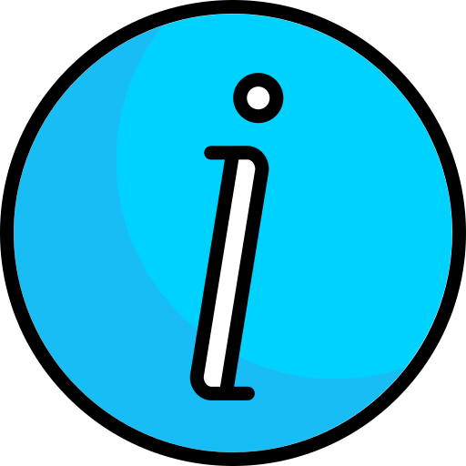

<!DOCTYPE html>
    <html lang="en">
    <head>
        <meta charset="UTF-8">
        <meta http-equiv="X-UA-Compatible" content="IE=edge">
        <meta name="viewport" content="width=device-width, initial-scale=1.0">
        <title>Portfolio</title>
        <link rel="stylesheet" href="stylesheet.css">
        
    </head>
    <body>
        

            

                <nav>
                    
                    <ul id="sidemenu">
                        <li><a href="#header">Home</a></li>
                        <li><a href="#about">About</a></li>
                        <li><a href="#services">Services</a></li>
                        <li><a href="#portfolio">Portfolio</a></li>
                        <li><a href="#contact">Contact</a></li>
                        <i class="fa-solid fa-circle-xmark" onclick="closemenu()"></i>
                    </ul>
                    <i class="fa-solid fa-bars" onclick="openmenu()"></i>
                </nav>

                

                    
UI/UX Designer

                    <h1>Hi, I'm Ikhsan Maulana From Indonesia</h1>
                

            

        

<!----------------------------------About----------------->
        

            

                

                    

                        
                    

                    

                        <h1 class="sub-title">About Me</h1>
                        
Lorem ipsum dolor sit amet consectetur adipisicing elit. Possimus cum distinctio, quasi perspiciatis saepe, nam sed officia at incidunt tempore ad iure labore nisi dolore deleniti sapiente rerum culpa harum?

                        

                            
Skills

                            
Experience

                            
Education

                        

                        

                            <ul>
                                <li>UI/UX Designing Web/App interfaces</li>
                                <li>Web Development Web/App Development</li>
                                <li>App Development Building Android/iOS apps</li>
                            </ul>
                        

                        

                            <ul>
                                <li>2019 - 2020 UI/UX design Training at ITB Institute</li>
                                <li>2020 - 2021 Team Head at Starapp</li>
                                <li>2022 - Current Building Android/iOS apps</li>
                            </ul>
                        

                        

                            <ul>
                                <li>UIN Ar-Raniry Banda Aceh 2013 - 2018 Arabic Language and Literature</li>
                                <li>Web Development Web/App Development</li>
                                <li>App Development Building Android/iOS apps</li>
                            </ul>
                        

                    

                

            

        

<!-----------------------Services--------------->
        

            

                <h1 class="sub-title">My Services</h1>
                

                    

                        <i class="fa-solid fa-code"></i>
                        <h2>Web Design</h2>
                        
Lorem ipsum dolor sit amet consectetur adipisicing elit. Laudantium sunt iste beatae impedit dolore cupiditate explicabo, debitis recusandae optio placeat eveniet ex fuga saepe, nisi quis, temporibus necessitatibus aliquam aliquid.

                        <a href="#">Learn more</a>
                    

                    

                        <i class="fa-solid fa-crop"></i>
                        <h2>UI/UX Design</h2>
                        
Lorem ipsum dolor sit amet consectetur adipisicing elit. Laudantium sunt iste beatae impedit dolore cupiditate explicabo, debitis recusandae optio placeat eveniet ex fuga saepe, nisi quis, temporibus necessitatibus aliquam aliquid.

                        <a href="#">Learn more</a>
                    

                    

                        <i class="fa-brands fa-app-store-ios"></i>
                        <h2>App Design</h2>
                        
Lorem ipsum dolor sit amet consectetur adipisicing elit. Laudantium sunt iste beatae impedit dolore cupiditate explicabo, debitis recusandae optio placeat eveniet ex fuga saepe, nisi quis, temporibus necessitatibus aliquam aliquid.

                        <a href="#">Learn more</a>
                    

                

            

        

<!----------------------------------Portfolio----------------->
        

            

                <h1 class="sub-title">My Work</h1>
                

                    

                        
                        

                            <h3>Al Qur'an App</h3>
                            
Lorem ipsum dolor sit amet, consectetur adipisicing elit. Illum facilis accusantium voluptas excepturi optio animi repellat, repellendus harum adipisci ex nisi quidem eius assumenda ipsa praesentium? Doloremque dolorum pariatur voluptate?

                            <a href="#"><i class="fa-solid fa-arrow-up-right-from-square"></i></a>
                        
 
                    

                    

                        
                        

                            <h3>Tilawah App</h3>
                            
Lorem ipsum dolor sit amet, consectetur adipisicing elit. Illum facilis accusantium voluptas excepturi optio animi repellat, repellendus harum adipisci ex nisi quidem eius assumenda ipsa praesentium? Doloremque dolorum pariatur voluptate?

                            <a href="#"><i class="fa-solid fa-arrow-up-right-from-square"></i></a>
                        

                    

                    

                        
                        

                            <h3>Ngaji Bareng App</h3>
                            
Lorem ipsum dolor sit amet, consectetur adipisicing elit. Illum facilis accusantium voluptas excepturi optio animi repellat, repellendus harum adipisci ex nisi quidem eius assumenda ipsa praesentium? Doloremque dolorum pariatur voluptate?

                            <a href="#"><i class="fa-solid fa-arrow-up-right-from-square"></i></a>
                        

                    

                

                <a href="" class="btn">See More</a>
            

        

        <!----------------------------------Contact Form----------------->
        

            

                

                    

                        <h1 class="sub-title">Contact Me</h1>
                        
<i class="fa-solid fa-paper-plane"></i>ikhsanmou95@gmail.com

                        
<i class="fa-solid fa-phone-volume"></i>+6281214710491

                        

                            <a href="https://facebook.com/"><i class="fa-brands fa-facebook"></i></a>
                            <a href="#"><i class="fa-brands fa-twitter-square"></i></a>
                            <a href="#"><i class="fa-brands fa-instagram"></i></a>
                            <a href="#"><i class="fa-brands fa-linkedin"></i></a>
                        

                        <a href="images/CV.pdf" download class="btn btn2">Download CV</a>
                    

                    

                        <form>
                            <input type="text" name="Name" placeholder="Your Name" required>
                            <input type="email" name="Email" placeholder="Your Email" required>
                            <textarea name="Message" rows="6" placeholder="Your Message"></textarea>
                            <button type="submit" class="btn btn2">Submit</button>
                        </form>
                    

                

            

            

                
Copyright <i class="fa-sharp fa-regular fa-copyright"></i>ikhsan, made with <i class="fa-sharp fa-solid fa-heart"></i> by Ikhsan Maulana

            

        

        

        
    </body>
</html>
